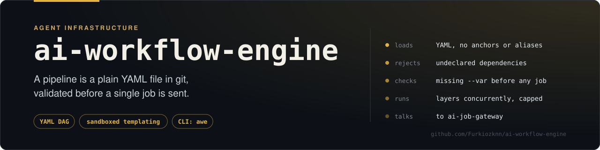
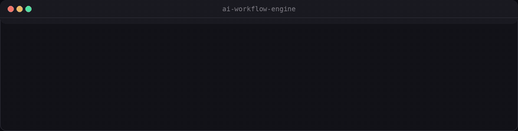
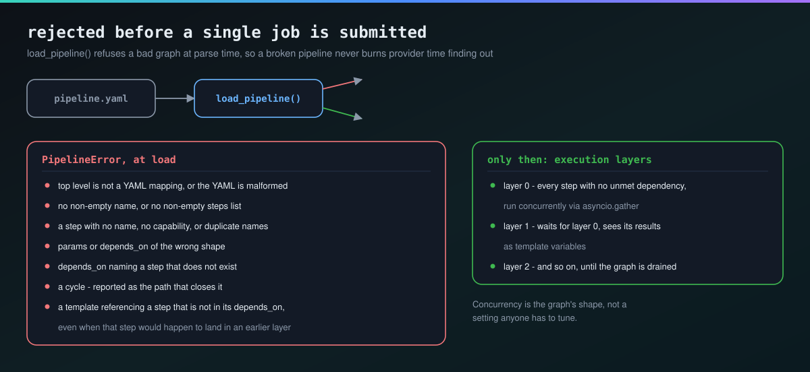
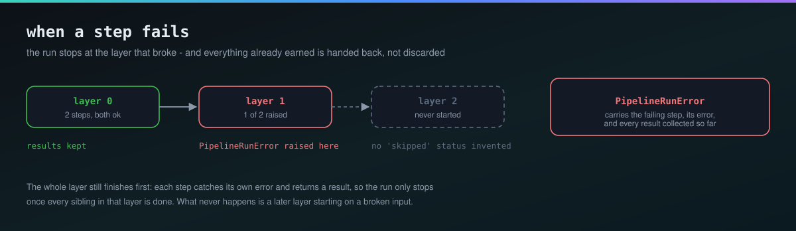

# ai-workflow-engine

**A pipeline is a plain YAML file that runs your generate → upscale → lip-sync chain as a DAG — checked into git, not built in a visual editor.**



<sub>Real output. The second file differs from the first by one typo in <code>depends_on</code>; it never reaches a gateway, because the DAG is resolved at load time.</sub>

A small DAG orchestrator that chains [`ai-job-gateway`](https://github.com/Furkiozknn/ai-job-gateway)-compatible jobs (generate → upscale → lip-sync, ...) defined as a YAML pipeline. The generalization of ComfyUI's "the graph is a durable, shareable artifact" lesson (see the research in [`Furkiozknn/Furkiozknn`](https://github.com/Furkiozknn/Furkiozknn)'s architecture doc), minus the visual node editor — a pipeline here is a plain YAML file, git-diffable like code.

Part of the same small ecosystem as [`ai-job-gateway`](https://github.com/Furkiozknn/ai-job-gateway), [`prompt-template-manager`](https://github.com/Furkiozknn/prompt-template-manager), [`model-comparison-harness`](https://github.com/Furkiozknn/model-comparison-harness), and [`asset-provenance-toolkit`](https://github.com/Furkiozknn/asset-provenance-toolkit) — coupled only through documented HTTP contracts, never through a shared Python dependency. Vendors the same [`gateway_poll.py`](https://github.com/Furkiozknn/ai-job-gateway/blob/main/src/ai_job_gateway/gateway_poll.py) module as the other three.

## Why

A single `ai-job-gateway` job is one model call. A real creative pipeline is usually several, chained: generate an image, then upscale it, then run lip-sync on the result. Wiring that by hand each time (submit, poll, copy the URL out of the result, submit the next job) is exactly the kind of repetitive plumbing this tool exists to remove — while staying just a plain YAML file, not a hosted visual builder.

## What it does

- Parses a **pipeline**: a named list of **steps**, each one job submission (`capability` + `params`).
- Validates the pipeline is a genuine DAG at load time: unknown `depends_on` references and cycles are rejected before anything runs, not discovered mid-execution.
- **Cross-checks every `steps.<name>` template reference against `depends_on`** at load time too (not just structural `depends_on` validity) — a step that reads another step's result without declaring that dependency is a real, silent bug (its actual execution order becomes accidental, dependent on what *other* deps happen to place it near), so it's now a load-time `PipelineError` naming exactly which step and which missing dependency, instead of a run that sometimes works and sometimes fails deep into execution.
- Groups steps into **execution layers**: everything in one layer has no dependency on anything else in that layer, so the whole layer runs **concurrently**. Independent steps never wait on each other just because they happen to be listed one after another in the file.
- **Paces that concurrency** rather than letting a layer's width become a burst: at most `--max-concurrent-steps` jobs are in flight at the gateway at once, and a job that keeps answering `processing` is polled progressively less often. See [Pacing](#pacing-what-a-layer-costs-the-gateway).
- Lets a later step's params reference an **earlier step's result** via Jinja2: `{{ steps.generate.result.image_url }}`. A typo'd or not-yet-finished step reference is a loud render-time error (`StrictUndefined`), not a silently empty string.
- Stops the pipeline (raising `PipelineRunError`) as soon as any step in a layer fails, while still surfacing every result already produced by earlier/same-layer steps (`partial_results`) — so you can see exactly how far it got.

## Install

```bash
uv sync --group dev
```

## Pipeline file format



```yaml
name: generate-and-upscale
steps:
  - name: generate
    capability: generate-image        # hosted (Pollinations.ai) - no key, but the prompt leaves the machine
    params:
      prompt: "{{ vars.prompt }}"
      width: 768
      height: 512
      seed: 42

  - name: upscale
    capability: media-upscale         # local (FSRCNN via mini-creative-toolkit)
    params:
      image_path: "{{ steps.generate.result.output_path }}"
      scale: 2
    depends_on: [generate]
```

These are real capabilities of [`ai-job-gateway`](https://github.com/Furkiozknn/ai-job-gateway) started with its `media` extra — `generate-image` is hosted and keyless, every `media-*` step runs locally. The gateway and the toolkit share a filesystem, so a step's `output_path` is a path the next step reads directly. [`examples/local-media-chain.yaml`](examples/local-media-chain.yaml) is a three-step pipeline (`inspect ∥ resize → optimize`) that never touches the network at all.

- `steps[].capability` — the `ai-job-gateway` capability to submit the job to (`POST /v1/{capability}`).
- `steps[].params` — the job's params. Any string value is rendered as a Jinja2 template against `vars.*` (CLI `--var KEY=VALUE`) and `steps.<name>.result.*` (any already-finished step in an earlier layer). Non-string values pass through unchanged.
- `steps[].depends_on` — explicit list of step names this step must wait for. **Not inferred from template references** — if a step's params reference `steps.generate...`, that step must also list `generate` in its own `depends_on`. This keeps the DAG's shape visible just by reading the YAML, without needing to parse every template string to know the execution order — and it's now **enforced**: a `steps.generate...` reference with `generate` missing from `depends_on` is rejected at load time (`awe validate` and `awe run` both call the same loader), not just documented as a convention to follow.

## CLI usage

```bash
# Validate a pipeline's structure and DAG, and list its execution layers +
# every vars.* name it references, without running anything
awe validate examples/generate-and-upscale.yaml
# OK: 'generate-and-upscale' - 2 step(s) in 2 layer(s)
#   layer 0: generate
#   layer 1: upscale
#   variables referenced: prompt

# Run it against a live ai-job-gateway server
awe run examples/generate-and-upscale.yaml \
    --gateway-url http://localhost:8000 \
    --var prompt="a red sneaker on a white background"
```

`awe run` prints every step's final `{status, result, error}` as JSON on success. On failure it prints which steps succeeded/failed to stderr and exits non-zero.

A pipeline with a step that reads another step's result without declaring the dependency, or that references a step name that doesn't exist, fails `validate`/`run` immediately with an actionable message rather than partway through a real run:

```
error: step 'upscale' references steps.generate... in its params but does not
list ['generate'] in depends_on -- add them so this step is guaranteed to run
after they finish, instead of the order being accidental
```

```
error: step 'upscale' references unknown step(s) via 'steps.<name>...': 'generat' (did you mean 'generate'?)
```

## Pacing: what a layer costs the gateway


A layer runs its steps concurrently, and until recently that was the whole
story — which meant a layer's *width* was also its burst size. A 40-step
fan-out submitted 40 jobs in the same event-loop tick (measured against the
mock transport in `tests/test_runner.py`), then polled all 40 at a fixed
interval until they finished. Two knobs bound that now, both on by default.

**How many steps are in flight.** `--max-concurrent-steps` (default `10`)
caps how many of a layer's jobs exist at the gateway at once. Every step
still runs — the cap paces them, it never drops one — and a layer narrower
than the cap is completely unaffected. `0` restores the old unbounded
behaviour. The number matches `ai-job-gateway`'s own
`DEFAULT_WEBHOOK_CONCURRENCY`, and sits inside httpx's 20-connection
keepalive pool, so a wide layer reuses connections instead of opening a new
one per step.

**How often each one asks.** The poll interval starts at
`--poll-interval` (default `0.3s`) and, once a job has been running for a
second, grows by 1.5× per poll up to `--max-poll-interval` (default `5s`).
A job that finishes quickly is never slowed down; a job that doesn't stops
being asked twenty times a minute. Measured on the mock transport at the
default `0.3s` base:

| job takes | polls, flat | polls, backing off | detection lag |
|---|---|---|---|
| 3s | 11 | 8 | +0.34s |
| 6s | 21 | 10 | +1.13s |
| 15s | 51 | 12 | +0.52s |
| 30s | 101 | 15 | +0.45s |

The lag column is the honest cost: you learn a job finished up to one
interval late, bounded by `--max-poll-interval`. That trade is worth naming
rather than burying — if a pipeline needs tighter latency more than it needs
fewer round trips, lower the ceiling.

## Library usage

```python
import asyncio
from ai_workflow_engine import load_pipeline, run_pipeline

pipeline = load_pipeline("pipeline.yaml")
results = asyncio.run(run_pipeline(pipeline, "http://localhost:8000", variables={"prompt": "a cat"}))
print(results["upscale"].result)
```

## Testing

```bash
uv run pytest -v
```

72 tests as of this writing.

## Security

A pipeline file can come from somewhere other than the operator who's about to run it: a shared library, a downloaded example, a pull request from someone whose YAML you haven't fully read. Two things in this project's parsing/rendering path deserved more scrutiny than "we trust operator-authored files," and both are now addressed:

**1. Jinja2 template injection (fixed).** `templating.py`'s `_ENV` is now a [`jinja2.sandbox.SandboxedEnvironment`](https://jinja.palletsprojects.com/en/stable/sandbox/), not a plain `Environment`. A plain `Environment` lets a malicious `params` string escape ordinary variable interpolation and reach arbitrary Python objects — the classic `{{ ''.__class__.__mro__[1].__subclasses__() }}` pattern, walking the class hierarchy toward something exploitable. `SandboxedEnvironment` blocks attribute access to underscore-prefixed names and restricts what's reachable at all, turning that into a caught `TemplateRenderError` ("unsafe operation: ...") instead of code execution. This was a drop-in change: every template in this repo's tests/examples only does `{{ vars.x }}` / `{{ steps.a.result.x }}` interpolation, none of which the sandbox restricts.

**2. YAML anchor/alias "billion laughs" (fixed).** `pipeline.py` now parses with a custom loader (`_NoAliasSafeLoader`) that rejects any `&anchor` / `*alias` in a pipeline file. Why this matters: a YAML alias makes the *parsed* object graph share references rather than duplicate them, so a small file with a few levels of nested anchors parses in milliseconds — but nothing downstream (Jinja2 rendering, `json.dumps` for `awe run`'s output) is alias-aware; each walks the params tree at full, naive depth. The instant either one touches a reference-shared structure, it reproduces the full exponential blowup a "billion laughs" attack depends on — a few hundred bytes of pipeline YAML can hang the process or exhaust memory. Pipeline files have no legitimate use for anchor reuse, so aliases are rejected outright at parse time with a message naming the offending anchor and line, rather than trying to bound the resulting size after the fact (which is already too late once the shared references exist).

**Honest limits, stated plainly:**

- Sandboxing Jinja2 is defense-in-depth, not a hard guarantee — sandbox escapes have existed historically in other tools built on the same mechanism. The genuinely safe stance is to never run a pipeline file you don't trust at all.
- Neither fix vets the *content* a rendered step sends to the gateway (a prompt-injection payload aimed at the downstream model, say) — that's a different, model-facing risk this tool has no visibility into.
- `steps[].capability` is not restricted to an allowlist — a pipeline can invoke any capability the target gateway exposes. That's unchanged and, for now, considered part of "a pipeline file is trusted the same as code that calls the gateway directly."

## Roadmap / known v1 limitations



- No retry policy per step — a failed step fails the whole run. Retries are a natural v2 addition once real (non-mock) providers surface which failures are worth retrying automatically.
- `depends_on` is explicit, not inferred from template references (see above) — but a `steps.<name>` reference **is now cross-checked against `depends_on`** at load time, so the two can no longer silently drift apart. Full auto-inference (deriving `depends_on` from template references instead of requiring both) was considered and deliberately deferred: it's a nicer authoring experience but removes the property that the DAG's shape is visible just from the `depends_on` lists, without parsing every template string.
- No persistence — a pipeline run's state lives only in the process that ran `awe run`. There's no resume-from-where-it-failed yet; re-running re-executes every step from scratch.
- The static `steps.<name>...` / `vars.<name>` reference scan (used by both the `depends_on` cross-check and `validate`'s "variables referenced" line) is best-effort: it recognizes the dotted-attribute form used throughout this project (`steps.generate.result.output`), not a dynamic/subscript form (`steps[some_var].result`). The latter isn't used anywhere in this project's own pipelines; the runtime `StrictUndefined` check still catches a real problem in that case, this is purely an early-warning layer on top.
- Poll backoff is deterministic, not jittered. A wide layer's steps are submitted together, so their polls stay roughly in step with each other; `--max-concurrent-steps` is what actually spreads them out, and the gateway is a local server rather than a rate-limited third party. Jitter (as `ai-job-gateway` uses for its webhook retries) would be the next refinement if that stops being true.
- The concurrency cap is per `run_pipeline` call, not per gateway. Two `awe run` processes against one gateway can still put 20 jobs in flight between them; a shared limit would need coordination this tool deliberately doesn't have.
- No visual DAG rendering (`--dag | dot -Tsvg`, à la Snakemake) — `awe validate`'s layer listing is the closest thing today.

## License

MIT
